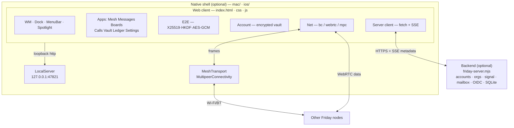
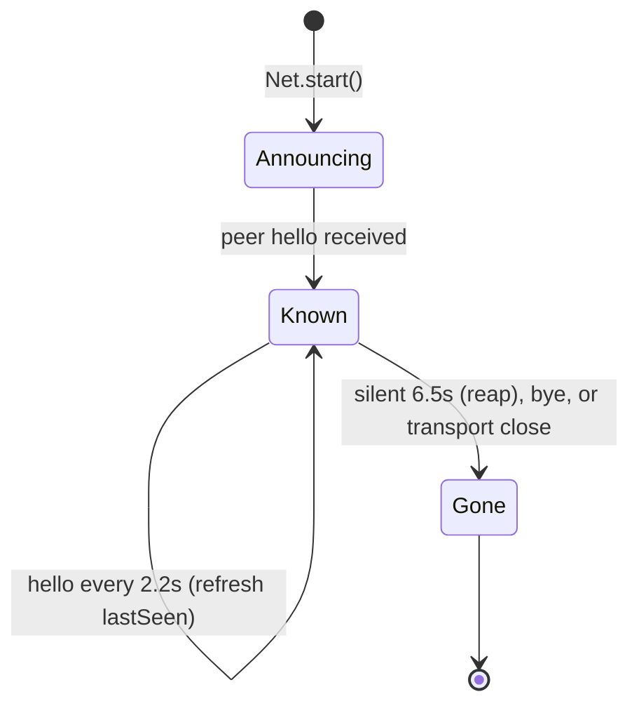
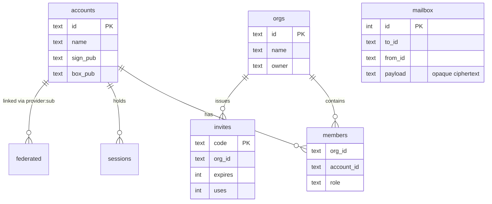

# Friday / Orange PIE — Technical Specification

**Project** Orange PIE V1 Alpha (Eros Office) · **Component** Friday (web + native
clients, optional rendezvous server) · **Author** Glass Stone LLC · **Status**
Draft 1.0 · **Revision** 2026‑07

This document specifies the protocols, data formats, and cryptographic
constructions of Friday as implemented. It is the engineering companion to the
user manual in [`docs/`](docs/README.md). Where this document and the code
disagree, the code (`js/friday.js`, `server/friday-server.mjs`,
`mac/Sources/*.swift`) is authoritative.

---

## 1. Design goals & non‑goals

### 1.1 Goals

| G | Goal |
|---|------|
| G1 | **No password anywhere.** Authentication is by digital signature; secrets never leave the device. |
| G2 | **Content confidentiality against intermediaries.** Message, board, voice, and file data is sealed end‑to‑end; relays and servers carry opaque bytes. |
| G3 | **Serverless operation.** Two devices can communicate with no infrastructure; density increases resilience. |
| G4 | **Off‑grid transport.** Apple devices relay for one another over Wi‑Fi/Bluetooth with no internet. |
| G5 | **One codebase, four platforms** (browser, PWA, macOS, iOS/iPadOS) with no runtime dependencies. |
| G6 | **Honest surfaces.** No capability is represented as more real or more secure than it is. |

### 1.2 Non‑goals

- Anonymity against a *running* org server (it observes presence and membership; run peer‑to‑peer to avoid this).
- Endpoint security (encryption cannot protect a compromised device).
- Formal cryptographic audit (standard primitives are used correctly but unaudited).
- Cross‑device *key* portability without re‑keying (identity is portable via federation; keys are per‑device by design).

---

## 2. System architecture



**Trust placement.** Keys and plaintext exist only inside the web client’s
process (per device). The backend is a *rendezvous and directory*: it never
holds a private key or plaintext. Native shells add transport and a secure‑context
origin; they do not add trust.

---

## 3. Identity & keys

Each account holds **two** keypairs, both generated client‑side at signup and
stored only inside the encrypted vault (§5):

| Keypair | Algorithm (fallback) | Use |
|---|---|---|
| **Box** (mesh) | X25519 (ECDH P‑256) | ECDH for E2E message sealing (§8) |
| **Sign** | Ed25519 (ECDSA P‑256) | Signing auth challenges to a server (§6) |

**Account id.** For key accounts, `id = "a-" || SHA‑256(signPub_JWK_canonical)[0:20]`
— self‑certifying and stable. For federated accounts, `id = "a-" ||
SHA‑256("oidc:" || provider || ":" || sub)[0:20]`.

**Node id.** The mesh node id is derived from the box public key so a device
keeps a stable identity across reloads. The transport‑level id used by the
off‑grid relay (§10) is an independent per‑process UUID.

---

## 4. Notation & constants

| Symbol | Value |
|---|---|
| `PBKDF2_ITERS` | 310 000 (SHA‑256) |
| `PBKDF2_SALT` | 16 random bytes / vault |
| `AESGCM_IV` | 12 random bytes / message |
| `HKDF_SALT` | UTF‑8 `"friday.e2e.v2"` |
| `RELAY_TTL` | 6 hops |
| `SEEN_TTL` | 5 min · `BUFFER_TTL` 10 min · `BUFFER_MAX` 256 |
| `PRESENCE` | announce 2.2 s · reap 6.5 s |
| `LOOPBACK_PORT` | 47821 (fixed, ephemeral fallback) |
| `MPC_SERVICE` | `friday-mesh` (`_friday-mesh._tcp`/`._udp`) |
| `b64` | standard Base64 unless noted `b64url` |

---

## 5. Account vault

The vault is the only sensitive artifact at rest on the device.

### 5.1 Plaintext structure

```jsonc
{ "name": "…", "createdAt": 0, "store": { /* boards, callLog, ledger, … */ },
  "alg": "X25519", "privJwk": {…}, "pubRaw": "b64",
  "signAlg": "Ed25519", "signPrivJwk": {…}, "signPubJwk": {…} }
```

### 5.2 Encryption

```
K_v  = PBKDF2-SHA256(passphrase, salt=PBKDF2_SALT, iters=PBKDF2_ITERS) → AES-256 key
ct   = AES-256-GCM(K_v, iv=AESGCM_IV, plaintext=UTF8(JSON(vault)))
```

### 5.3 Stored record — `localStorage["friday.vault.<id>"]`

```json
{ "v": 2, "name": "…", "salt": "b64", "iters": 310000, "iv": "b64", "ct": "b64" }
```

The passphrase and `K_v` are never persisted. Unlock re‑derives `K_v` and
attempts GCM decrypt; failure ⇒ wrong passphrase (authenticated, no oracle).
An index at `localStorage["friday.logins.v1"]` enumerates logins. **Remember‑me**
stores `K_v` as a *non‑extractable* `CryptoKey` in IndexedDB (`friday.keys` /
`vaultKeys`).

---

## 6. Authentication protocol (server)

Signature challenge/response. No secret is transmitted.

```mermaid
sequenceDiagram
  participant C as Client
  participant S as Server
  C->>S: POST /api/challenge {signPub}
  Note right of S: nonce bound to signPub<br/>5-min TTL, single-use
  S-->>C: {nonce}
  C->>C: sig = Sign(signPriv, nonce)
  C->>S: POST /api/login {signPub, nonce, sig, boxPub?}
  S->>S: verify sig over nonce with signPub; consume nonce
  alt valid
    S-->>C: {token, account} (256-bit bearer)
  else forged or replayed
    S-->>C: 401 / 400
  end
```

- Registration is identical with `POST /api/register {name, signPub, boxPub, nonce, sig}`.
- Verification uses WebCrypto‑exported JWK → `crypto.verify` (Node) with `null`
  hash for Ed25519, `sha256` + `ieee-p1363` DSA encoding for ECDSA P‑256.
- Sessions are bearer tokens (`Authorization: Bearer <token>`), rows in `sessions`.

---

## 7. Federated identity (OIDC)

OpenID Connect **Authorization Code + PKCE**. Identity only: the vault key is
never given to the server (§ manual/06).

```mermaid
sequenceDiagram
  participant C as Client (popup)
  participant S as Friday server
  participant P as OIDC provider
  C->>S: GET /api/auth/{prov}/start
  S->>S: make state + PKCE verifier; challenge = S256(verifier)
  S-->>C: {authUrl with state, nonce, code_challenge}
  C->>P: authorize (user consents)
  P-->>C: 302 to /api/auth/{prov}/callback?code&state
  C->>S: callback
  S->>P: POST token (code, verifier, client_secret)
  P-->>S: {id_token}
  S->>P: fetch JWKS
  S->>S: verify id_token (RS256/ES256, iss, aud, exp, nonce)
  S->>S: upsert account by provider:sub; issue session
  S-->>C: HTML posts {token, account} via BroadcastChannel
  C->>S: POST /api/account/keys {boxPub, signPub} (bind device keys)
```

Re‑login with the same `provider:sub` returns the same account id (org
continuity). Providers are configured in `server/providers.json`; with none, no
buttons are advertised.

---

## 8. End‑to‑end encryption

### 8.1 Key agreement (pairwise, on demand)

```
shared = ECDH(myBoxPriv, peerBoxPub)                         # 32 bytes
K_ab   = HKDF-SHA256(shared, salt=HKDF_SALT, info="") → AES-256 key
```

ECDH symmetry gives both endpoints the same `K_ab` with no key transmitted;
`K_ab` is cached per peer. Fingerprint `= SHA‑256( sort(b64(a)‖b64(b)) )[0:4]`
(hex, order‑independent) is displayed to both ends for out‑of‑band comparison.

### 8.2 Seal / open — the `wire` object

```jsonc
wire = { "alg": "X25519 · HKDF · AES-256-GCM",
         "iv": "b64(12B)", "ct": "b64(AES-256-GCM(K_ab, iv, UTF8(text)))",
         "bytes": 56, "fp": "AB12 CD34" }
```

- Sender seals with the recipient’s box public key; recipient opens with the
  sender’s. Broadcast‑room messages are sealed **once per recipient** (fan‑out).
- Only `wire` traverses the network. GCM provides confidentiality **and**
  authentication; a single bit flip fails to decrypt (verified). A third party
  lacking `K_ab` cannot open it (verified).

### 8.3 Applications

Messages (all frames), Boards (CRDT ops), Calls (audio frames sealed *beyond*
DTLS‑SRTP), Vault (encrypt‑then‑erasure‑code), and offline mailbox all carry the
`wire` and nothing else in plaintext.

---

## 9. Mesh layer (`Net`)

### 9.1 Frame vocabulary

| `t` | Fields | Meaning |
|---|---|---|
| `hello` | `id, name, pub` | presence + box public key |
| `bye` | `id` | departure |
| `ping` / `pong` | `id, to, n` | RTT measurement |
| `msg` | `id, to, from, room, wire` | sealed message envelope |
| `typing` | `id, room, to?` | throttled typing indicator |

`wire` is opaque to the mesh. `Net.send(obj)` fans a frame across **all**
transports; `Net.recv(m, transport)` ignores self‑origin frames and dispatches by
`t`. Peers announce `pub` in `hello`, enabling immediate pairwise sealing.

### 9.2 Presence lifecycle



### 9.3 Transports

| Transport | Reach | Establishment |
|---|---|---|
| BroadcastChannel | same‑origin contexts on one machine | implicit |
| WebRTC DataChannel | device ↔ device | copy/paste **or** server signaling |
| MultipeerConnectivity | nearby Apple devices (Wi‑Fi/BT) | native app (§10) |

WebRTC signaling: manual (offer→answer codes) or via the server’s SSE `signal`
relay; deterministic initiator (lower account id offers) avoids glare. Public
STUN is used only for NAT discovery.

---

## 10. Off‑grid relay (native)

### 10.1 Envelope (native ↔ native, MultipeerConnectivity, `.required` encryption)

```jsonc
MeshEnvelope = { "fid": "uuid",   // dedup key
                 "ttl": 6,        // hops remaining; 0 ⇒ terminal
                 "origin": "node",
                 "payload": "JSON string of a §9.1 web frame",
                 "ts": 1700000000000 }
```

### 10.2 Relay algorithm (`RelayStore` + `MeshTransport`)

```
on receive(env, from):
    if not RelayStore.accept(env.fid):   # dedup — already flooded here
        drop
    RelayStore.remember(env)             # store-and-forward buffer
    deliver payload to web layer once    # → FridayNativeMesh.recv → Net.recv(_, "mpc")
    if env.ttl > 1:
        env.ttl -= 1
        broadcast env to connectedPeers \ {from}   # relay (flood, minus sender)

on peerConnected(p):
    for env in RelayStore.replay(): send env to p  # store-and-forward
```

Dedup and buffer entries expire (`SEEN_TTL`, `BUFFER_TTL`); the buffer is capped
(`BUFFER_MAX`). Properties verified by `mac/Tests/RelayStoreTests.swift`:
dedup, TTL decrement, replay‑with‑expiry, bounded buffer, wire round‑trip.

### 10.3 Native ↔ web bridge

Injected at document‑start, `window.FridayNativeMesh = { available, send(frame),
recv(frame), peers(list) }`. `Net.send` fans to `send`; native delivers incoming
frames to `recv` (→ `Net.recv(frame,"mpc")`). Contract verified in‑browser with
the real injected shim.

**Limit.** Radio *discovery* requires physical Wi‑Fi/Bluetooth; the iOS Simulator
does not emulate it. The relay algorithm and bridge are verified without hardware.

---

## 11. Signaling, rendezvous & mailbox (server)

- **`POST /api/signal {to, payload}`** — relays an opaque SDP blob to an online
  peer over its SSE stream; the server never parses it. After exchange, media/data
  are peer‑to‑peer.
- **`POST /api/mailbox {to, payload}`** — if the recipient is offline, stores the
  sealed `wire` and delivers it on their next `GET /api/events` connect.
- **`GET /api/events`** (SSE) — pushes `presence`, `signal`, `member-joined`,
  `mail`; 25 s heartbeat; presence drives automatic peer connection.

The server’s only live role is rendezvous; the only thing it stores is
unreadable ciphertext for offline peers.

---

## 12. Backend data model



SQLite (WAL) at `server/friday.db`. `challenges`, `oidc_state`, and `mailbox` are
swept on a timer (5 min / 10 min / 30 days). Zero external dependencies —
`node:http`, `node:sqlite`, `node:crypto` only. Full endpoint table:
[docs/16](docs/16-reference.md).

---

## 13. Native shell & secure context

The shell serves bundled web assets over `http://127.0.0.1:LOOPBACK_PORT`. This
is deliberate: WebCrypto, service workers, and BroadcastChannel require a
**secure context**, which loopback HTTP satisfies and `file://` does not
reliably. A **fixed** port keeps the origin — and therefore the per‑origin
localStorage/IndexedDB (saved logins) — stable across launches; an ephemeral port
is used only if the fixed one is bound. `LocalServer` (Foundation `Network`)
guards against path traversal and refuses paths outside the bundle. Single‑instance
apps share one origin, so multiple windows mesh over BroadcastChannel.

---

## 14. Security analysis (threat model)

| Threat (STRIDE) | Vector | Mitigation |
|---|---|---|
| **Spoofing** | impersonate an account | signature challenge; account id derived from key; forged sig → 401 |
| **Tampering** (message) | flip ciphertext | AES‑256‑GCM authentication; decrypt fails |
| **Tampering** (ledger) | edit a record | FNV‑1a hash chain; downstream hashes break |
| **Repudiation** | deny sending | signed auth; (per‑message non‑repudiation not a goal) |
| **Information disclosure** (content) | server/relay reads data | E2E seal; intermediaries carry `wire` only |
| **Information disclosure** (metadata) | server observes presence/membership | run peer‑to‑peer/off‑grid; server sees no content |
| **DoS** — replay | reuse a login nonce | single‑use, 5‑min nonce |
| **DoS** — flood | mesh loop / spam | dedup by `fid`, bounded TTL & buffers; PoW admission (spec) |
| **Elevation** | non‑member reads directory | membership check → 403; invite expiry & use caps |
| **Key theft at rest** | read the vault | PBKDF2(310k)+AES‑GCM; passphrase never stored |
| **Remembered‑key theft** | read the stored key | non‑extractable CryptoKey; browser‑profile trust boundary (disclosed) |

Residual risks are enumerated in §1.2 and [docs/04](docs/04-security-model.md):
metadata to a running server, endpoint compromise, ad‑hoc‑signed native builds,
and the absence of a formal audit.

---

## 15. Verification & conformance

| Area | Method | Result |
|---|---|---|
| E2E scheme | Node WebCrypto round‑trip; tamper & third‑party rejection | pass |
| Auth protocol | backend exercise: register/login, forged sig, nonce replay | pass |
| OIDC | mock issuer: PKCE, JWKS verify, claim checks, continuity, key bind | pass |
| Relay engine | `RelayStore` unit tests (dedup/TTL/store/bound/roundtrip) | pass |
| Native bridge | in‑browser real‑shim contract (send/recv/peers) | pass |
| Multi‑login | DevTools‑Protocol lifecycle (create/remember/switch/forget/migrate) | pass |
| Org flow | two‑browser CDP: signup→org→invite→join→directory→WebRTC link | pass |
| Native apps | build + launch (Mac, iPhone, iPad); loopback 200; crypto present | pass |

Reproduce the core checks from [docs/16](docs/16-reference.md).

---

## 16. Appendix — wire formats at a glance

```
vault record   { v, name, salt, iv, ct, iters }                 localStorage
message wire   { alg, iv, ct, bytes, fp }                       inside a `msg` frame
mesh frame     { t, id, [name|to|from|room|pub|wire|n] }        Net transports
mesh envelope  { fid, ttl, origin, payload, ts }                MultipeerConnectivity
session        Authorization: Bearer <256-bit token>            server
oidc start     { authUrl }  ·  callback → { token, account }    server
```

**Glossary, repo map, constants, and the full API table:**
[docs/16 · Reference](docs/16-reference.md). **User‑facing manual:**
[docs/README](docs/README.md).

---

*Glass Stone LLC · CEO Gabriel B. Rodriguez · Orange PIE V1 Alpha · 2026–2027.
Interface set in the Hudson Design Language, by The Acadia.*
